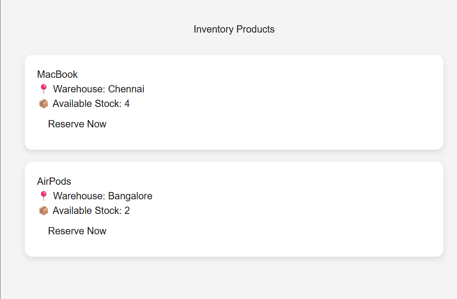
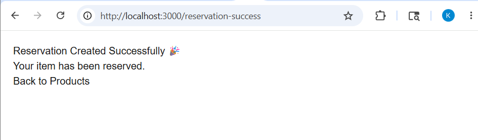
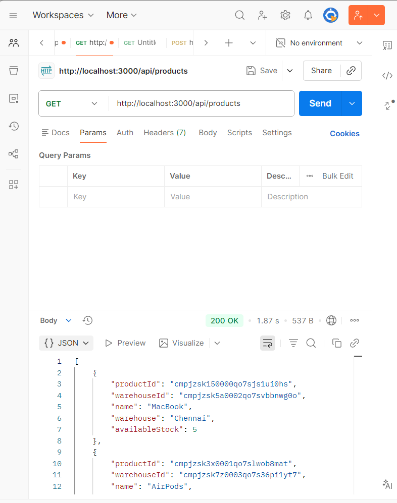

# ALLO Inventory Reservation System

Inventory reservation system built using Next.js, Prisma, PostgreSQL, and Neon Database.

---

## Features

### Backend
- Product inventory management
- Reservation creation
- Reservation confirmation
- Reservation release/cancellation
- Warehouse stock tracking
- Inventory validation to prevent over-reservation

### Frontend
- Product listing page
- Warehouse and stock visibility
- Reserve product functionality
- Reservation success page
- Frontend integrated with backend APIs

---

## Tech Stack

- Next.js
- TypeScript
- Prisma ORM
- PostgreSQL
- Neon Database

---

## Setup Instructions

Clone the repository:

```bash
git clone https://github.com/keerthana-k2509/allo-inventory.git
```

Move into the project folder:

```bash
cd allo-inventory
```

Install dependencies:

```bash
npm install
```

Run the development server:

```bash
npm run dev
```

Open the frontend application:

```bash
http://localhost:3000/products
```

---

## Project Workflow

1. User opens Product Listing page
2. Product inventory is fetched from backend API
3. Products and stock availability are displayed
4. User clicks **Reserve Now**
5. Reservation API is triggered
6. Reservation is created successfully
7. User is redirected to Reservation Success page

---

## API Endpoints

### Get Products

```http
GET /api/products
```

### Create Reservation

```http
POST /api/reservations
```

Request Body:

```json
{
  "productId": "cmpjzsk150000qo7sjs1ui0hs",
  "warehouseId": "cmpjzsk5a0002qo7svbbnwg0o",
  "quantity": 1
}
```

### Confirm Reservation

```http
POST /api/reservations/{id}/confirm
```

### Release Reservation

```http
POST /api/reservations/{id}/release
```

---

## Screenshots

### Product Listing Page

Inventory Products page showing available products, warehouse details and reserve functionality.



### Reservation Success Page

Displayed after successful reservation creation.



### Products API Response

Response from GET /api/products endpoint.



---

## Notes

- Built for ALLO campus placement take-home exercise
- Inventory reservation logic prevents stock overbooking
- Frontend and backend integrated successfully
- End-to-end reservation workflow implemented