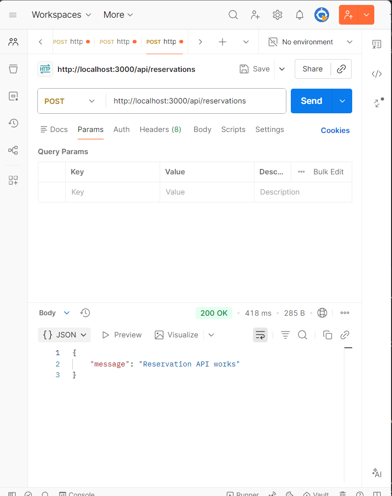
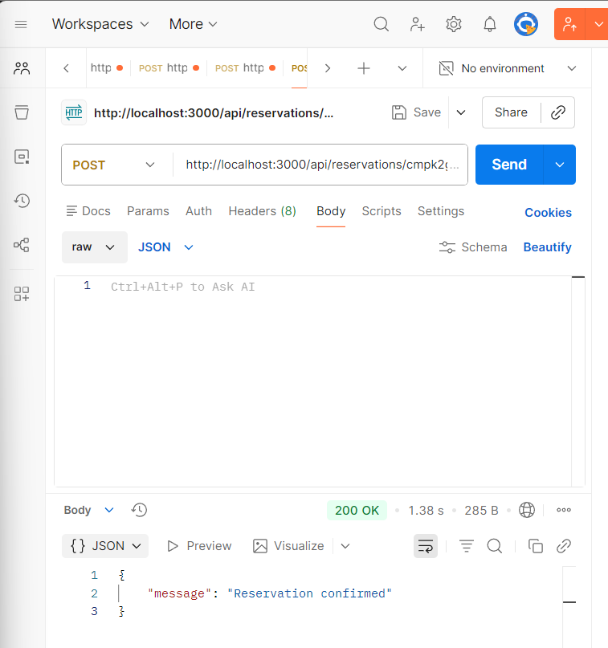
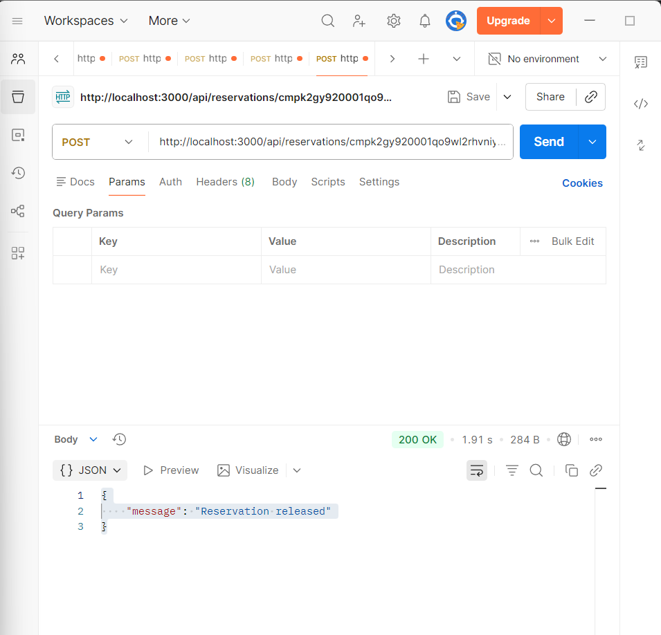

# ALLO Inventory Reservation System

Inventory reservation system built using Next.js, Prisma, PostgreSQL, and Neon.

## Features

- Product inventory management
- Reservation creation
- Reservation confirmation
- Reservation release/cancellation
- Warehouse stock tracking

## Tech Stack

- Next.js
- TypeScript
- Prisma
- PostgreSQL
- Neon Database

## Setup Instructions

Clone the repository:

```bash
git clone <your-github-repo-link>
```

Install dependencies:

```bash
npm install
```

Run the project:

```bash
npm run dev
```

Open:

```bash
http://localhost:3000
```

## API Endpoints

### Get Products

GET /api/products

### Create Reservation

POST /api/reservations

```json
{
  "productId":"cmpjzsk150000qo7sjs1ui0hs",
  "warehouseId":"cmpjzsk5a0002qo7svbbnwg0o",
  "quantity":1
}
```

### Confirm Reservation

POST /api/reservations/{id}/confirm

### Release Reservation

POST /api/reservations/{id}/release

## Screenshots

### Products API


### Reservation Created


### Reservation Confirmed


### Reservation Released
